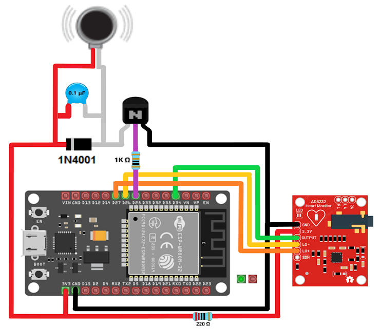

# HERMES-CODES-ESP32

EMG (electromyographic) signal processing system using an ESP32 and the AD8232 sensor. This project detects voluntary muscle activations and converts them into digital events for external applications.

## 🚀 Description
HERMES processes EMG signals in real time using basic filtering, feature extraction, and validation techniques to reliably detect muscle contractions.

## ⚙️ Features
- EMG signal acquisition with AD8232  
- Real-time processing on ESP32  
- Muscle activation detection  
- False positive reduction (validation logic)  
- Bluetooth communication  

## 📌 Usage
This repository contains the base code for signal acquisition and processing. It can be adapted for:
- Human-machine interfaces  
- Assistive technologies  
- Control systems  
- Research projects  

## 🔌 Circuit

## 📂 Project Structure
